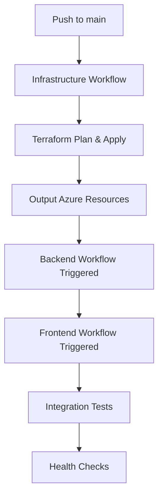
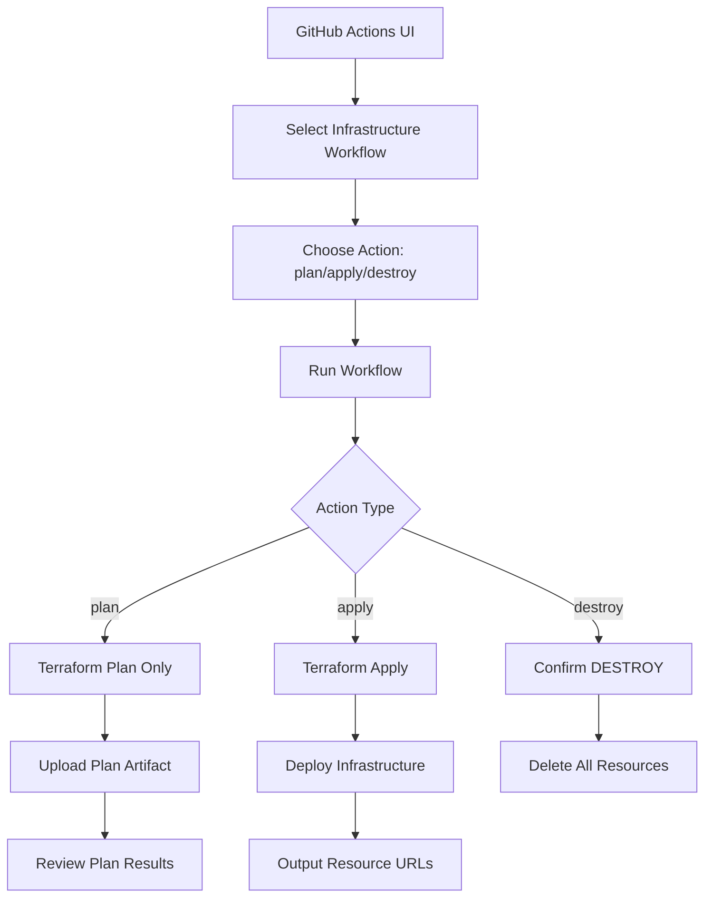
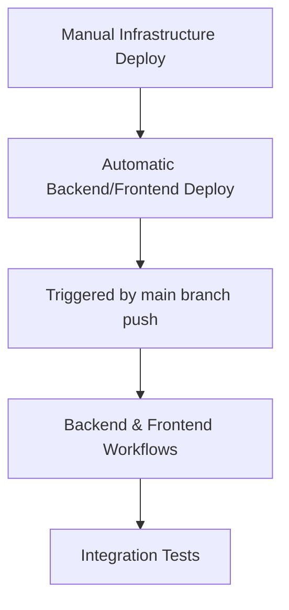

# CI/CDパイプライン仕様書

## 概要

本仕様書では、2環境構成（ローカル開発 + Azureデモ環境）に対応したCI/CDパイプラインを定義します。

## 環境構成

### ローカル開発環境
- 開発者の手動デプロイメント
- Container Appsへの直接接続
- デバッグ・テスト実行

### Azureデモ環境
- GitHub ActionsによるCI/CD自動化
- Static Web Apps + Container Apps Linked Backend
- Infrastructure as Code (Terraform)

## CI/CDワークフロー

### ワークフロー実行方式

#### 自動実行
- **Push to main**: インフラ変更時の自動デプロイ
- **Pull Request**: Terraform Planの自動実行とコメント表示
- **Workflow Chain**: Infrastructure → Backend → Frontend → Integration

#### 手動実行（Workflow Dispatch）
GitHub ActionsのUIから手動でワークフローを実行可能：

**Infrastructure Workflow**:
- **Action**: `plan` / `apply` / `destroy`
- **Environment**: `demo`
- **Destroy Confirmation**: 破壊的操作時の確認フィールド

**使用例**:
1. **計画確認**: `Action: plan` → Terraform計画をアーティファクトとして保存
2. **手動デプロイ**: `Action: apply` → インフラを即座にデプロイ
3. **環境削除**: `Action: destroy` + `confirm_destroy: CONFIRM` → 環境を完全削除

### 1. インフラストラクチャデプロイ

#### `.github/workflows/infrastructure.yml`
```yaml
name: Deploy Infrastructure

on:
  push:
    branches: [main]
    paths: ['infra/**', '.github/workflows/infrastructure.yml']
  pull_request:
    branches: [main]
    paths: ['infra/**']
  workflow_dispatch:
    inputs:
      action:
        description: 'Terraform Action'
        required: true
        default: 'plan'
        type: choice
        options:
        - plan
        - apply
        - destroy
      environment:
        description: 'Target Environment'
        required: true
        default: 'demo'
        type: choice
        options:
        - demo
      confirm_destroy:
        description: 'Type "CONFIRM" to proceed with destroy'
        required: false
        type: string

env:
  ARM_CLIENT_ID: ${{ secrets.AZURE_CLIENT_ID }}
  ARM_CLIENT_SECRET: ${{ secrets.AZURE_CLIENT_SECRET }}
  ARM_SUBSCRIPTION_ID: ${{ secrets.AZURE_SUBSCRIPTION_ID }}
  ARM_TENANT_ID: ${{ secrets.AZURE_TENANT_ID }}

jobs:
  terraform:
    name: 'Terraform ${{ github.event.inputs.action || 'Deploy' }}'
    runs-on: ubuntu-latest
    environment: ${{ github.event.inputs.environment || 'demo' }}
    
    defaults:
      run:
        shell: bash
        working-directory: ./infra

    steps:
    - name: Checkout
      uses: actions/checkout@v4

    - name: Setup Terraform
      uses: hashicorp/setup-terraform@v3
      with:
        terraform_version: 1.5.0

    - name: Terraform Format Check
      run: terraform fmt -check

    - name: Terraform Init
      run: terraform init

    - name: Terraform Validate
      run: terraform validate

    - name: Terraform Plan
      id: plan
      run: |
        terraform plan -var-file="environments/${{ github.event.inputs.environment || 'demo' }}.tfvars" -no-color -out=tfplan
        terraform show -no-color tfplan
      continue-on-error: false

    - name: Terraform Apply
      if: |
        (github.ref == 'refs/heads/main' && github.event_name == 'push') ||
        (github.event.inputs.action == 'apply' && github.event_name == 'workflow_dispatch')
      run: |
        echo "🚀 Applying Terraform changes..."
        terraform apply -auto-approve tfplan

    - name: Confirm Destroy
      if: github.event.inputs.action == 'destroy'
      run: |
        if [ "${{ github.event.inputs.confirm_destroy }}" != "CONFIRM" ]; then
          echo "❌ Destroy action requires 'CONFIRM' in the confirm_destroy input"
          exit 1
        fi
        echo "⚠️  Proceeding with infrastructure destruction..."

    - name: Terraform Destroy
      if: github.event.inputs.action == 'destroy' && github.event.inputs.confirm_destroy == 'CONFIRM'
      run: |
        echo "🗑️ Destroying infrastructure..."
        terraform destroy -var-file="environments/${{ github.event.inputs.environment || 'demo' }}.tfvars" -auto-approve

    - name: Output Important Values
      if: |
        (github.ref == 'refs/heads/main' && github.event_name == 'push') ||
        (github.event.inputs.action == 'apply' && github.event_name == 'workflow_dispatch')
      run: |
        echo "📋 Terraform Outputs:"
        echo "CONTAINER_APPS_FQDN=$(terraform output -raw container_apps_fqdn)" >> $GITHUB_ENV
        echo "STATIC_WEB_APP_HOSTNAME=$(terraform output -raw static_web_app_hostname)" >> $GITHUB_ENV
        echo "COSMOS_DB_ENDPOINT=$(terraform output -raw cosmos_db_endpoint)" >> $GITHUB_ENV
        
        # 出力値をサマリーに表示
        echo "## 🎯 Infrastructure Deployment Results" >> $GITHUB_STEP_SUMMARY
        echo "| Resource | Value |" >> $GITHUB_STEP_SUMMARY
        echo "|----------|-------|" >> $GITHUB_STEP_SUMMARY
        echo "| Container Apps FQDN | $(terraform output -raw container_apps_fqdn) |" >> $GITHUB_STEP_SUMMARY
        echo "| Static Web App Hostname | $(terraform output -raw static_web_app_hostname) |" >> $GITHUB_STEP_SUMMARY
        echo "| Cosmos DB Endpoint | $(terraform output -raw cosmos_db_endpoint) |" >> $GITHUB_STEP_SUMMARY

    - name: Upload Terraform Plan
      if: github.event.inputs.action == 'plan' || github.event_name == 'pull_request'
      uses: actions/upload-artifact@v4
      with:
        name: terraform-plan-${{ github.event.inputs.environment || 'demo' }}
        path: infra/tfplan
        retention-days: 30

    - name: Comment PR with Plan
      if: github.event_name == 'pull_request'
      uses: actions/github-script@v7
      with:
        script: |
          const fs = require('fs');
          const { execSync } = require('child_process');
          
          // Terraform planの結果を取得
          const planOutput = execSync('cd infra && terraform show -no-color tfplan', { encoding: 'utf-8' });
          
          const comment = `## 🏗️ Terraform Plan Results
          
          <details>
          <summary>📋 Click to expand plan output</summary>
          
          \`\`\`hcl
          ${planOutput}
          \`\`\`
          </details>
          
          **Action Required:** Review the plan and merge to apply changes automatically.
          `;
          
          github.rest.issues.createComment({
            issue_number: context.issue.number,
            owner: context.repo.owner,
            repo: context.repo.repo,
            body: comment
          });
```

### 2. バックエンドAPIデプロイ

#### `.github/workflows/backend.yml`
```yaml
name: Deploy Backend API

on:
  push:
    branches: [main]
    paths: ['backend/**', '.github/workflows/backend.yml']
  pull_request:
    branches: [main]
    paths: ['backend/**']
  workflow_dispatch:

env:
  REGISTRY_NAME: ${{ secrets.AZURE_REGISTRY_NAME }}
  IMAGE_NAME: todo-backend
  
jobs:
  build-and-deploy:
    runs-on: ubuntu-latest
    environment: demo
    
    steps:
    - name: Checkout
      uses: actions/checkout@v4

    - name: Set up Python 3.13
      uses: actions/setup-python@v4
      with:
        python-version: '3.13'

    - name: Install uv
      run: |
        curl -LsSf https://astral.sh/uv/install.sh | sh
        echo "$HOME/.cargo/bin" >> $GITHUB_PATH

    - name: Install dependencies
      working-directory: ./backend
      run: |
        uv sync --frozen

    - name: Run tests
      working-directory: ./backend
      run: |
        uv run pytest tests/ -v --cov=app --cov-report=xml

    - name: Upload coverage to Codecov
      uses: codecov/codecov-action@v3
      with:
        file: ./backend/coverage.xml
        flags: backend
        name: backend-coverage

    - name: Log in to Azure Container Registry
      uses: azure/docker-login@v1
      with:
        login-server: ${{ secrets.AZURE_REGISTRY_NAME }}.azurecr.io
        username: ${{ secrets.AZURE_REGISTRY_USERNAME }}
        password: ${{ secrets.AZURE_REGISTRY_PASSWORD }}

    - name: Build and push Docker image
      working-directory: ./backend
      run: |
        docker build -t ${{ secrets.AZURE_REGISTRY_NAME }}.azurecr.io/${{ env.IMAGE_NAME }}:${{ github.sha }} .
        docker build -t ${{ secrets.AZURE_REGISTRY_NAME }}.azurecr.io/${{ env.IMAGE_NAME }}:latest .
        docker push ${{ secrets.AZURE_REGISTRY_NAME }}.azurecr.io/${{ env.IMAGE_NAME }}:${{ github.sha }}
        docker push ${{ secrets.AZURE_REGISTRY_NAME }}.azurecr.io/${{ env.IMAGE_NAME }}:latest

    - name: Deploy to Container Apps
      uses: azure/container-apps-deploy-action@v1
      with:
        acrName: ${{ secrets.AZURE_REGISTRY_NAME }}
        containerAppName: ${{ secrets.AZURE_CONTAINER_APP_NAME }}
        resourceGroup: ${{ secrets.AZURE_RESOURCE_GROUP }}
        imageToDeploy: ${{ secrets.AZURE_REGISTRY_NAME }}.azurecr.io/${{ env.IMAGE_NAME }}:${{ github.sha }}
        environmentVariables: |
          AZURE_COSMOS_CONNECTION_STRING=${{ secrets.AZURE_COSMOS_CONNECTION_STRING }}
          APPLICATIONINSIGHTS_CONNECTION_STRING=${{ secrets.APPLICATIONINSIGHTS_CONNECTION_STRING }}
          ENVIRONMENT=demo
```

### 3. フロントエンドデプロイ

#### `.github/workflows/frontend.yml`
```yaml
name: Deploy Frontend (Static Web Apps)

on:
  push:
    branches: [main]
    paths: ['frontend/**', '.github/workflows/frontend.yml']
  pull_request:
    branches: [main]
    paths: ['frontend/**']
  workflow_dispatch:

jobs:
  build_and_deploy:
    if: github.event_name == 'push' || (github.event_name == 'pull_request' && github.event.action != 'closed')
    runs-on: ubuntu-latest
    name: Build and Deploy
    environment: demo
    
    steps:
    - uses: actions/checkout@v4
      with:
        submodules: true

    - name: Setup Node.js
      uses: actions/setup-node@v4
      with:
        node-version: '18'
        cache: 'npm'
        cache-dependency-path: frontend/package-lock.json

    - name: Install dependencies
      working-directory: ./frontend
      run: npm ci

    - name: Run tests
      working-directory: ./frontend
      run: npm run test:ci

    - name: Run E2E tests
      working-directory: ./frontend
      run: |
        npm run build:test
        npm run test:e2e:ci

    - name: Build
      working-directory: ./frontend
      run: npm run build
      env:
        VITE_APP_VERSION: ${{ github.sha }}
        VITE_ENVIRONMENT: demo
        APPLICATIONINSIGHTS_CONNECTION_STRING: ${{ secrets.APPLICATIONINSIGHTS_CONNECTION_STRING }}

    - name: Deploy to Static Web Apps
      uses: Azure/static-web-apps-deploy@v1
      with:
        azure_static_web_apps_api_token: ${{ secrets.AZURE_STATIC_WEB_APPS_API_TOKEN }}
        repo_token: ${{ secrets.GITHUB_TOKEN }}
        action: "upload"
        app_location: "frontend"
        api_location: ""  # Linked Backendを使用するためAPI locationは空
        output_location: "dist"
        app_build_command: "npm run build"

  close_pull_request:
    if: github.event_name == 'pull_request' && github.event.action == 'closed'
    runs-on: ubuntu-latest
    name: Close Pull Request
    steps:
    - name: Close Pull Request
      uses: Azure/static-web-apps-deploy@v1
      with:
        azure_static_web_apps_api_token: ${{ secrets.AZURE_STATIC_WEB_APPS_API_TOKEN }}
        action: "close"
```

### 4. 統合テスト・デプロイ

#### `.github/workflows/integration.yml`
```yaml
name: Integration Tests and Deployment

on:
  workflow_run:
    workflows: ["Deploy Infrastructure", "Deploy Backend API", "Deploy Frontend (Static Web Apps)"]
    types: [completed]
    branches: [main]
  workflow_dispatch:

jobs:
  integration-tests:
    runs-on: ubuntu-latest
    environment: demo
    if: ${{ github.event.workflow_run.conclusion == 'success' }}
    
    steps:
    - name: Checkout
      uses: actions/checkout@v4

    - name: Setup Node.js
      uses: actions/setup-node@v4
      with:
        node-version: '18'

    - name: Install dependencies
      run: npm ci
      working-directory: ./tests/integration

    - name: Wait for deployment
      run: |
        echo "Waiting for services to be ready..."
        sleep 60

    - name: Run Integration Tests
      working-directory: ./tests/integration
      env:
        BASE_URL: https://${{ secrets.STATIC_WEB_APP_HOSTNAME }}
        API_BASE_URL: https://${{ secrets.STATIC_WEB_APP_HOSTNAME }}/api
      run: |
        npm run test:integration

    - name: Run Load Tests
      uses: azure/load-testing@v1
      with:
        loadTestConfigFile: 'tests/load/load-test-config.yaml'
        loadTestResource: ${{ secrets.AZURE_LOAD_TESTING_RESOURCE }}
        resourceGroup: ${{ secrets.AZURE_RESOURCE_GROUP }}
        env: |
          webapp.url=https://${{ secrets.STATIC_WEB_APP_HOSTNAME }}

  health-check:
    runs-on: ubuntu-latest
    needs: integration-tests
    steps:
    - name: Application Health Check
      run: |
        # ヘルスチェックエンドポイントの確認
        response=$(curl -s -o /dev/null -w "%{http_code}" https://${{ secrets.STATIC_WEB_APP_HOSTNAME }}/api/health)
        if [ $response -eq 200 ]; then
          echo "✅ Application is healthy"
        else
          echo "❌ Application health check failed with status: $response"
          exit 1
        fi

    - name: Memory Stress Test
      run: |
        # ランダムメモリ消費機能のテスト
        echo "Testing random memory consumption feature..."
        for i in {1..5}; do
          echo "Test $i/5"
          response=$(curl -s -X POST https://${{ secrets.STATIC_WEB_APP_HOSTNAME }}/api/todos \
            -H "Content-Type: application/json" \
            -d '{"title":"Test Memory Stress '$i'","description":"Testing random memory consumption"}')
          echo "Response: $response"
          sleep 2
        done

  deployment-notification:
    runs-on: ubuntu-latest
    needs: [integration-tests, health-check]
    if: always()
    steps:
    - name: Notify deployment status
      uses: 8398a7/action-slack@v3
      with:
        status: ${{ job.status }}
        channel: '#deployments'
        text: |
          🚀 Todo App Demo Deployment
          📍 Environment: Azure Demo
          📊 Status: ${{ job.status }}
          🔗 URL: https://${{ secrets.STATIC_WEB_APP_HOSTNAME }}
          🐙 Commit: ${{ github.sha }}
      env:
        SLACK_WEBHOOK_URL: ${{ secrets.SLACK_WEBHOOK_URL }}
```

## 必要なGitHub Secrets

### シークレット管理方針
- **Environment Secrets (推奨)**: `demo`環境に定義されたシークレット
- **Repository Secrets**: リポジトリ全体で共有されるシークレット
- **Priority**: Environment Secrets > Repository Secrets

### シークレット設定場所

#### GitHub環境での設定方法
1. **Environment Secrets（推奨）**:
   - リポジトリ → Settings → Environments → `demo` → Environment secrets
   - より安全（環境保護ルール適用）
   - 環境別の値設定可能

2. **Repository Secrets（代替）**:
   - リポジトリ → Settings → Secrets and variables → Actions → Repository secrets
   - リポジトリ全体で共有
   - シンプルな管理

### Azure認証（Environment推奨）
```
AZURE_CLIENT_ID          # Service PrincipalのアプリケーションID
AZURE_CLIENT_SECRET      # Service Principalのシークレット  
AZURE_SUBSCRIPTION_ID    # AzureサブスクリプションID
AZURE_TENANT_ID          # Azure ADテナントID
```

### Azureリソース（Environment推奨）
```
AZURE_RESOURCE_GROUP            # デプロイ先リソースグループ名
AZURE_REGISTRY_NAME             # Container Registry名
AZURE_REGISTRY_USERNAME         # Container Registry認証用ユーザー名
AZURE_REGISTRY_PASSWORD         # Container Registry認証用パスワード
AZURE_CONTAINER_APP_NAME        # Container Apps名
AZURE_STATIC_WEB_APPS_API_TOKEN # Static Web Apps APIトークン
AZURE_LOAD_TESTING_RESOURCE     # Load Testing リソース名
```

### 接続文字列（Environment推奨）
```
AZURE_COSMOS_CONNECTION_STRING      # Cosmos DB接続文字列
APPLICATIONINSIGHTS_CONNECTION_STRING # Application Insights接続文字列
```

### Static Web Apps（Environment推奨）
```
STATIC_WEB_APP_HOSTNAME  # Static Web Appsのホスト名（例: myapp.azurestaticapps.net）
```

### 通知（Repository可）
```
SLACK_WEBHOOK_URL        # Slack通知用WebhookURL（オプション）
```

## 手動実行（Workflow Dispatch）の使用方法

### 0. 事前準備：Environment Secrets設定

#### demo環境の作成と設定
1. **GitHub Environment作成**:
   - リポジトリ → Settings → Environments
   - 「New environment」→ 名前: `demo`
   - 「Configure environment」

2. **Environment Protection設定**（推奨）:
   ```
   ✅ Required reviewers: リポジトリ管理者
   ✅ Wait timer: 0 minutes  
   ✅ Deployment branches: Selected branches → main
   ```

3. **Environment Secrets設定**:
   - Environment secrets → 「Add secret」
   - 以下のシークレットを設定:

#### 必須Environment Secrets一覧
```bash
# Azure認証
AZURE_CLIENT_ID=xxxxxxxx-xxxx-xxxx-xxxx-xxxxxxxxxxxx
AZURE_CLIENT_SECRET=your-service-principal-secret
AZURE_SUBSCRIPTION_ID=xxxxxxxx-xxxx-xxxx-xxxx-xxxxxxxxxxxx  
AZURE_TENANT_ID=xxxxxxxx-xxxx-xxxx-xxxx-xxxxxxxxxxxx

# Azureリソース
AZURE_RESOURCE_GROUP=rg-todo-demo
AZURE_REGISTRY_NAME=acrtododemo
AZURE_REGISTRY_USERNAME=acrtododemo
AZURE_REGISTRY_PASSWORD=your-acr-password
AZURE_CONTAINER_APP_NAME=ca-todo-backend-demo
AZURE_STATIC_WEB_APPS_API_TOKEN=your-swa-api-token
AZURE_LOAD_TESTING_RESOURCE=lt-todo-demo

# 接続文字列
AZURE_COSMOS_CONNECTION_STRING=AccountEndpoint=https://...
APPLICATIONINSIGHTS_CONNECTION_STRING=InstrumentationKey=...

# Static Web Apps
STATIC_WEB_APP_HOSTNAME=myapp.azurestaticapps.net

# 通知（オプション）
SLACK_WEBHOOK_URL=https://hooks.slack.com/services/...
```

### 1. Infrastructure手動実行
GitHub ActionsのUIで以下の手順で実行：

1. **リポジトリのActions タブ**に移動
2. **"Deploy Infrastructure"** ワークフローを選択
3. **"Run workflow"** ボタンをクリック
4. **パラメータを設定**:
   - `Action`: `plan` (確認のみ) / `apply` (実行) / `destroy` (削除)
   - `Environment`: `demo`
   - `Confirm Destroy`: 削除時のみ `CONFIRM` と入力

### 2. 実行例

#### インフラ計画確認
```
Action: plan
Environment: demo
Confirm Destroy: (空白)
```
→ Terraform planを実行し、変更内容をアーティファクトとして保存

#### インフラ即座デプロイ
```
Action: apply
Environment: demo
Confirm Destroy: (空白)
```
→ インフラを即座にデプロイし、出力値をGitHub Summaryに表示

#### インフラ完全削除
```
Action: destroy
Environment: demo
Confirm Destroy: CONFIRM
```
→ **⚠️警告**: すべてのリソースを削除（取り消し不可）

### 3. 安全機能

#### Destroy保護
- `destroy`アクションは`confirm_destroy: CONFIRM`が必要
- 入力値が正確でない場合はワークフロー失敗

#### Plan出力
- Terraform planの結果をGitHub Step Summaryに表示
- PRコメントに計画内容を自動投稿
- Plan結果をアーティファクトとして30日間保存

#### 環境保護
- `environment: demo`による承認ルール適用
- GitHub Environmentsのprotection rules有効

### 4. シークレット取得の仕組み

#### 現在の実装での動作
```yaml
jobs:
  terraform:
    environment: demo  # demo環境を指定
    # ↓ シークレット取得の優先順位
    # 1. demo環境のEnvironment Secrets
    # 2. Repository Secrets（フォールバック）
```

#### シークレット取得例
```yaml
# Environment Secret優先で取得
env:
  ARM_CLIENT_ID: ${{ secrets.AZURE_CLIENT_ID }}
  # ↑ 以下の順序で検索:
  # 1. demo環境のAZURE_CLIENT_ID
  # 2. Repository levelのAZURE_CLIENT_ID
```

#### 推奨設定パターン
```yaml
# パターン1: Environment Secrets（推奨）
environment: demo
env:
  ARM_CLIENT_ID: ${{ secrets.AZURE_CLIENT_ID }}  # demo環境から取得

# パターン2: Repository Secrets（シンプル）
# environment: demo を削除
env:
  ARM_CLIENT_ID: ${{ secrets.AZURE_CLIENT_ID }}  # Repositoryから取得
```

## デプロイフロー

### 1. 自動デプロイフロー（Infrastructure First）


### 2. 手動デプロイフロー（Workflow Dispatch）


### 3. 混合デプロイフロー


### 4. 障害時の自動ロールバック
```yaml
- name: Rollback on failure
  if: failure()
  run: |
    # 前のバージョンへのロールバック
    az containerapp revision set-active \
      --name ${{ secrets.AZURE_CONTAINER_APP_NAME }} \
      --resource-group ${{ secrets.AZURE_RESOURCE_GROUP }} \
      --revision-name previous-stable
```

## 監視・アラート統合

### Application Insights連携
- デプロイメント追跡
- パフォーマンスメトリクス
- エラー監視
- カスタムイベント追跡

### GitHub Environments
- **demo環境**: 本番相当の保護ルール
- レビュー必要な変更の制御
- 環境別シークレット管理

## コスト最適化

### 効率的なCI/CD
- 変更のあるコンポーネントのみビルド・デプロイ
- パラレル実行によるビルド時間短縮
- キャッシュ活用によるリソース削減

### リソース管理
- 使用していないPRブランチの自動クリーンアップ
- 夜間・週末のリソーススケールダウン（オプション）

## セキュリティ

### シークレット管理
- GitHub SecretsによるAzure認証情報管理
- 環境別のシークレット分離
- 最小権限の原則

### Workflow Dispatch セキュリティ
- **Environment Protection**: `demo`環境での承認ルール
- **Destroy Protection**: 削除時の明示的確認フィールド
- **Branch Protection**: main ブランチからの実行制限
- **Audit Log**: GitHub Actions実行履歴の完全記録

### アクセス制御
- **Repository Admin**: すべてのworkflow_dispatch実行可能
- **Write Permission**: Infrastructure以外のワークフロー実行可能
- **Destroy Action**: Repository Admin + 明示的確認のみ

### セキュリティベストプラクティス
```yaml
# workflow_dispatchのセキュリティ設定例
on:
  workflow_dispatch:
    inputs:
      confirm_destroy:
        description: 'Type "CONFIRM" to proceed with destroy'
        required: false
        type: string

jobs:
  terraform:
    environment: demo  # Environment protection有効
    if: |
      github.ref == 'refs/heads/main' &&
      (github.actor == 'admin' || contains(github.actor, 'approved-user'))
```

### コードスキャン
- 依存関係の脆弱性スキャン
- コード品質チェック
- Container イメージスキャン
- Terraform設定ファイルのセキュリティスキャン

## 関連ドキュメント
- [インフラストラクチャ仕様書](./infrastructure-specification.md)
- [バックエンド仕様書](./backend-specification.md)
- [フロントエンド仕様書](./frontend-specification.md)
